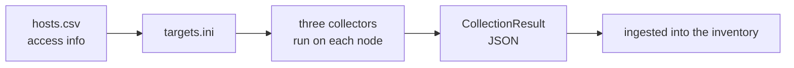

[English](README.md) · 한국어

# pqcota-discovery: 관측(1단계)

**실행 중인 시스템이 실제로 어떤 암호 알고리즘을 쓰는지**를 관측합니다. 암호문이나 키를 읽는 것이 아니라, **어떤 라이브러리와 provider, 알고리즘이 로드되고 등록되고 협상되는지**를 봅니다. 정적인 문서 스캔이나 소스 스캔이 보지 못하는 **런타임의 실제 모습**(런타임에 등록된 provider, 실제로 로드된 라이브러리, 통신에서 실제로 협상된 그룹)을 포착하고, 자산마다 양자내성 상태를 붙입니다(🟢 양자내성·하이브리드 · 🔴 고전 = 양자 취약 · ⚪ 등급 미정).

**왜 런타임인가:** 설정(`openssl.cnf`, `java.security`, nginx `ssl_ciphers`)은 *허용 목록*이라 실제와 어긋납니다. 거기에 적힌 PQC 그룹은 상대가 지원하지 않으면 고전 알고리즘으로 되돌아가고, 애플리케이션이 런타임에 등록한 provider는 `java.security`에 나타나지 않을 수 있습니다. 그래서 증거는 **실행 중인 프로세스에 로드된 라이브러리**와 **핸드셰이크에서 협상된 알고리즘**에서 얻습니다. 런타임에 닿지 못하면 설정으로 되돌아가지만, 그때는 `evidence_strength`를 낮추고 갭을 기록합니다.

이 리포지터리는 [pqcota](https://github.com/randyinthedev-hash/pqcota)를 이루는 다섯 리포지터리 중 하나입니다. `pqcota-common`, `pqcota-inventory`, `pqcota-discovery`, `pqcota-provisioning`, 그리고 통합 리포지터리 `pqcota`(데모, 예제, 릴리스 번들, 기여 안내)입니다.

## 한눈에 보기



## 구성 요소

| 구성 요소 | 설명 |
|---|---|
| **접근 준비**: `pqcota-hosts` | 사용자가 작성한 `hosts.csv`로 Ansible 인벤토리를 만듭니다 |
| **수집기 셋** | 아래에 나열합니다. 관측 대상 머신에서 실행되어 `CollectionResult`를 냅니다 |
| **참조 플레이북**: [`ansible/`](ansible) | 준비된 노드들에 수집기를 배포하고 실행하고 결과를 가져오고 정리합니다 |

| 수집기 | 무엇을 관측하는가 | 방식 |
|---|---|---|
| **openssl** | 로드된 libcrypto/libssl, 포크, 애플리케이션 식별 | `/proc`과 ELF를 **직접** 파싱합니다(Linux). `ldd`나 `readelf`에 의존하지 않습니다 |
| **jvm** ★ | 실행 중인 JVM의 **실제** JCA provider 체인(등록 순서 포함) | JVM attach 후 `getProviders()`(순수 Java 사이드카) |
| **network** | TLS/SSH 핸드셰이크 그룹에서 얻는 통신 연결 간선 | 수동 AF_PACKET 캡처(Linux), 복호화하지 않음 |

★ 이 단계의 **핵심 기능**은 jvm attach가 **동적으로 등록된 provider**(예를 들어 런타임에 `addProvider`로 추가된 BouncyCastle)를 잡아낸다는 점입니다. 정적 스캔은 이를 볼 수 없으며, 이를 채운 전용 오픈소스는 없었습니다.

## 빠르게 해 보기

**노드 하나를 그 자리에서**: 설치할 것이 없고 Ansible도 필요 없습니다.

> 아래 명령은 **Linux** 노드용입니다. Windows에서는 `pqcota-cngscan`과 `pqcota-jvmscan`을 씁니다. 어느 OS에서 어느 수집기가 실행되는지는 [명령 참조](cmd/README.ko.md)에 있습니다.

```bash
pqcota-nodescan --output table            # a table on screen (nothing is stored)
pqcota-nodescan node-01 > result.json     # JSON (when accumulating centrally)
```

**노드 여러 개**: 접근 정보를 적고 참조 플레이북으로 한꺼번에 실행합니다.

```bash
pqcota-hosts --ansible-out targets.ini hosts.csv
ansible-playbook -i targets.ini ansible/discover.yml
pqcota-ingest ./results                   # ingest the retrieved results into the inventory
```

명령별 인자, 권한, 환경변수는 [cmd/README](cmd/README.ko.md)에 있습니다.

## 동작하지 않을 때: 증상과 원인

| 증상 | 원인 |
|---|---|
| `could not open /proc, so nothing was observed` | Linux가 아닙니다. 결과는 빈 결과가 아니라 **갭**으로 나갑니다 |
| 스캔하는 프로세스 자신의 자산만 보입니다 | root가 아닙니다. 다른 사용자의 `/proc`을 읽을 수 없습니다(관측하지 못한 것은 갭으로 보고됩니다) |
| `no CAP_NET_RAW — could not observe` | `setcap cap_net_raw+ep`를 하거나 root로 실행합니다. 종료 코드는 일부러 0입니다. 갭이 중앙까지 전달되게 하기 위해서입니다 |
| JVM provider가 **정적 체인만** 보입니다 | attach가 막혀 대체 경로로 돌아갔습니다(`DisableAttachMechanism`, JEP 451, 권한). 런타임에 등록된 provider는 거기서 사각지대이며 갭으로 보고됩니다 |
| 관측된 연결 간선이 0입니다 | 관측 구간에 핸드셰이크가 오가지 않았습니다. 유휴 연결은 운영 환경에서도 보이지 않습니다. **없다는 뜻이 아니라 관측하지 못했다는 뜻**입니다 |

## 들어 있는 것

| 경로 | 내용 |
|---|---|
| `collectors/` | 수집기: `openssl`, `jvm`(Java 사이드카 포함), `network`, `cng` |
| `cmd/` | 명령: `pqcota-nodescan`, `pqcota-jvmscan`, `pqcota-netcap`, `pqcota-cngscan`, `pqcota-hosts`, `pqcota-procs` |
| [`ansible/`](ansible/README.ko.md) | 준비된 노드들에서 수집기를 실행하는 참조 플레이북 |
| `pkg/discovery/procs/` | 수집기들이 함께 쓰는 프로세스 식별 |
| `examples/` | 실행 가능한 예제: 접근 준비, 수집한 결과의 적재, JVM 정찰에서 attach까지 |

## 의존하는 것

`pqcota-common`과 `pqcota-inventory`입니다. 이 모듈 안에서 수집기는 `pqcota-common`과 `pkg/discovery/procs`만 import합니다. 수집기는 관측 대상 노드에 올라가는 바이너리에 들어가기 때문입니다.

## 빌드와 테스트

```bash
make            # every check of this repository
go test ./...   # unit tests only
```

`make build-jar`는 Java attach 사이드카(`build/collector.jar`, JDK 11 이상 필요)를 빌드합니다. `make build`는 linux/amd64와 windows/amd64용으로도 크로스 컴파일합니다. 수집기의 핵심이 빌드 태그 뒤의 Linux 전용 코드이기 때문입니다.

`go.mod`는 `replace` 지시문(`../pqcota-common` 등)으로 형제 리포지터리를 `../`에서 읽으므로 리포지터리를 나란히 클론해야 합니다. `replace` 줄은 그대로 둡니다. 그것은 리포지터리들 사이의 로컬 연결이고, `require` 줄은 릴리스 태그(현재 `v0.10.3`)를 가리키며 이 작업 공간 밖의 소비자는 그것을 받습니다. [빌드 안내](https://github.com/randyinthedev-hash/pqcota/blob/main/docs/build.ko.md#소스-받기)를 보세요.

## 함께 보기

프로세스 식별 라이브러리 [`pkg/discovery/procs`](pkg/discovery/procs) · 정규화와 이력 라이브러리 [`pkg/inventory/`](https://github.com/randyinthedev-hash/pqcota-inventory/tree/main/pkg/inventory) · 실행 가능한 예제 [`examples/discovery/`](examples/discovery)

## 기여 · 보안 · 라이선스

기여와 보안 신고는 [pqcota 리포지터리](https://github.com/randyinthedev-hash/pqcota)에 설명되어 있습니다. 라이선스는 [Apache-2.0](https://github.com/randyinthedev-hash/pqcota/blob/main/LICENSE)입니다.
